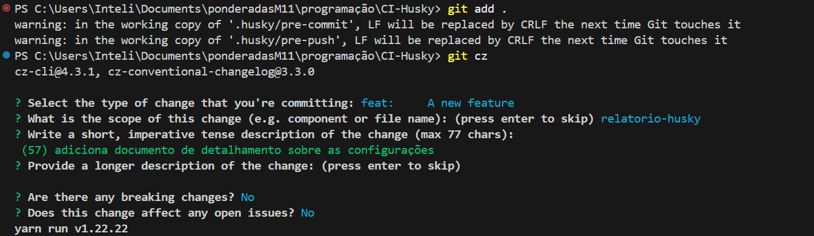
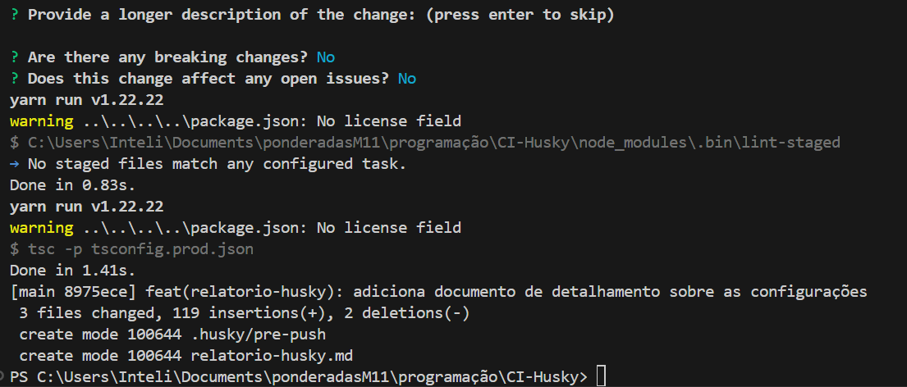
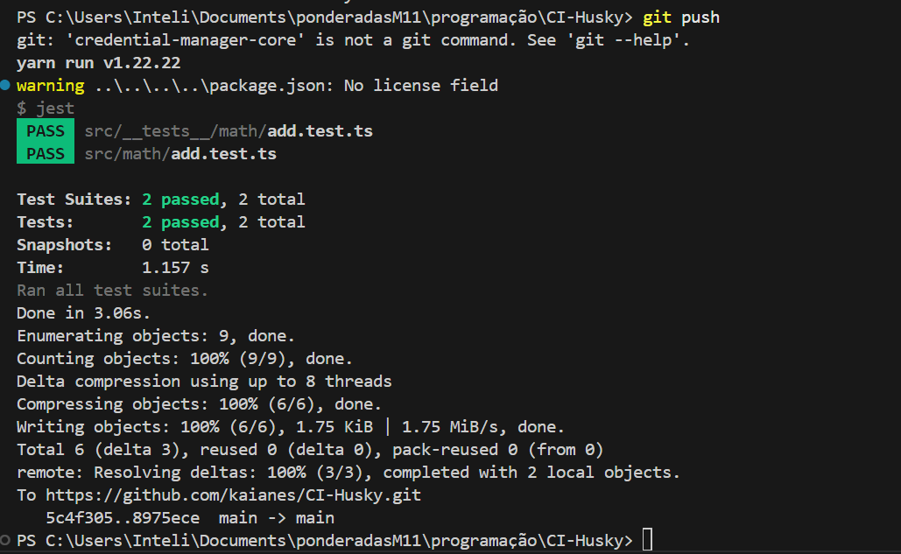
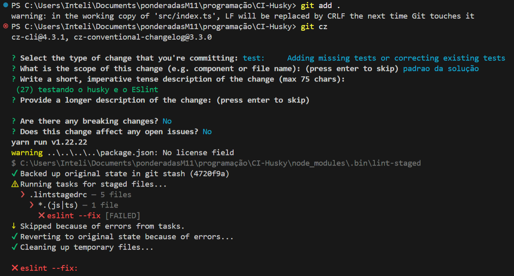
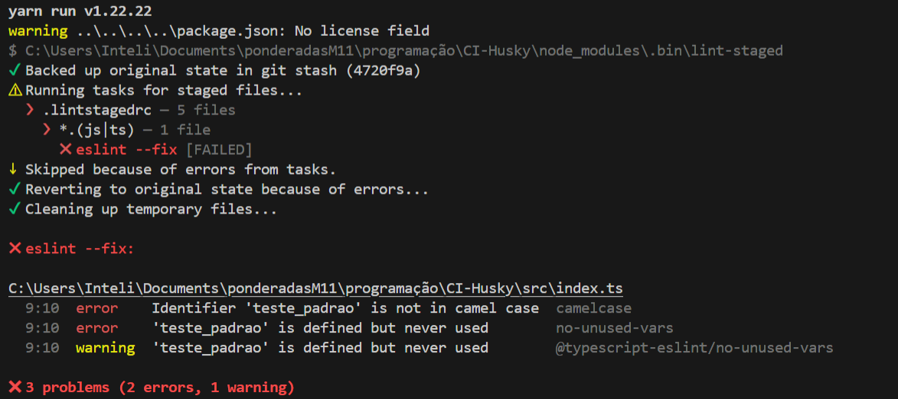

# 🛠️ Qualidade de Código com ESLint, Prettier, Husky, Testes e Commitizen

Este projeto utiliza uma configuração automatizada para garantir a qualidade e estabilidade do código antes de qualquer commit ou push.

---

## ⚙️ Ferramentas Utilizadas

- **ESLint**: análise estática para encontrar erros e más práticas.
- **Commitizen**: ferramenta que guia a escrita de mensagens de commit no padrão Conventional Commits.
- **Prettier**: formatação automática do código.
- **Husky**: execução de scripts em hooks do Git.
- **lint-staged**: aplica lint apenas nos arquivos modificados.
- **Jest**: testes automatizados.
- **TypeScript** + **Airbnb Base** para padronização de estilo.

---

## 🔐 Validações Automáticas

| Hook Git       | Ação Executada              |
|----------------|-----------------------------|
| `pre-commit`   | Lint + Compilação (`build`) |
| `pre-push`     | Testes automatizados        |
| `commit-msg`   | Verificação de Conventional Commits |

---

## 📁 Estrutura dos Hooks

### `.husky/pre-commit`

````bash
#!/usr/bin/env sh
. "$(dirname -- "$0")/_/husky.sh"

yarn lint-staged
yarn build
````

### `.husky/pre-push`

````bash
#!/usr/bin/env sh
. "$(dirname -- "$0")/_/husky.sh"

yarn test
````

### `.husky/commit-msg`

````bash
#!/bin/sh

if ! head -1 "$1" | grep -qE "^(feat|fix|docs|style|refactor|perf|test|chore|build|ci|revert|wip|improvement|update)(\(.+?\))?: .{1,}$"; then
  echo "ERROR: Commit message does not follow the conventional commit format." >&2
  echo "Please use one of the following types: feat, fix, docs, style, refactor, perf, test, chore, build, ci, revert, wip, improvement, update." >&2
  exit 1
fi

if ! head -1 "$1" | grep -qE "^.{1,88}$"; then
  echo "ERROR: Aborting commit. Commit message is too long." >&2
  exit 1
fi
````

---

## 🚀 Scripts disponíveis

````json
"scripts": {
  "lint": "eslint .",
  "lint:fix": "eslint  --fix",
  "test": "jest",
  "build": "tsc -p tsconfig.prod.json",
  "prepare": "husky install",
}
````

---

## 🧩 Configuração Padrão do ESLint

O projeto segue os padrões:

- `eslint:recommended`
- `@typescript-eslint/recommended`
- `airbnb-base`
- `plugin:prettier/recommended`

---

## ✔️ Benefícios

- Previne commits com código quebrado.
- Evita pushes com testes falhando.
- Garante histórico de commits padronizado.
- Mantém o código limpo, organizado e funcional.

---

## ▶️ Como utilizar

### Commitizen



A imagem mostra o uso do **Commitizen** para realizar um commit padronizado no terminal, utilizando o formato **Conventional Commits**. O usuário executa `git cz`, o que aciona um assistente interativo que orienta o preenchimento das etapas da mensagem de commit. 
Nesse exemplo, o tipo de alteração selecionado foi `feat` (indicando uma nova funcionalidade), com escopo definido como `relatorio-husky`. A descrição curta foi `(57) adiciona documento de detalhamento sobre as configurações`, seguida da confirmação de que **não houve breaking changes nem issues abertas afetadas**. 
Esse processo garante mensagens de commit consistentes e facilita a geração de changelogs e o entendimento histórico do projeto.

### Husky & ESlint



Já na próxima etapa, a imagem mostra a conclusão bem-sucedida de um commit realizado com **Commitizen** e validado por hooks configurados com **Husky**. 
Após preencher os campos obrigatórios do Conventional Commits, o sistema executa os comandos definidos no `pre-commit`, como o `lint-staged` (que não encontrou arquivos alterados para verificar - uma vez  que procura por arquivos ``.js`` ou ``.ts``) e a compilação com `tsc` via `tsconfig.prod.json`, que foi concluída em 1.41 segundos. 
Em seguida, o commit é efetivado com a hash `8975ece`, registrando a alteração do tipo `feat` com escopo `relatorio-husky`. Foram alterados 3 arquivos, incluindo a criação do script `.husky/pre-push` e do documento `relatorio-husky.md`, demonstrando que os ganchos de validação e a padronização de commits estão funcionando conforme o esperado.

### Testes e Push



Na última parte do fluxo, a imagem mostra a execução bem-sucedida do comando `git push`, integrando o uso de **Husky com o hook `pre-push`**, que executa testes automatizados antes de enviar os commits ao repositório remoto. O `jest` foi executado automaticamente e passou em todos os testes (`2 passed` de `2 total`), validando os arquivos `add.test.ts`. Após a aprovação dos testes, o Git completou o push para o repositório remoto no GitHub (`kaianes/CI-Husky`), confirmando que as alterações da branch `main` foram sincronizadas com sucesso. Esse fluxo reforça a segurança do código, garantindo que apenas alterações testadas sejam compartilhadas com o time.

#####  Extra: erros e arquivos .js\\.ts 

Para esse próximo exemplo, alterei um arquivo .js com um padrão fora do estabelecido:



A imagem mostra o Commitizen sendo usado normalmente para gerar uma mensagem de commit, mas o processo de commit é **interrompido automaticamente pelo Husky** devido à falha na verificação de lint com o ESLint.

Nesse caso, o usuário alterou um arquivo `.js` ou `.ts` com um padrão fora do estabelecido, e o **`lint-staged`** tentou aplicar o comando `eslint --fix`, que **falhou** ao encontrar erros que não puderam ser corrigidos automaticamente. Como resultado:

* O commit foi **cancelado**;
* O Git **reverteu o estado original dos arquivos com `git stash`**;
* O Husky limpou os arquivos temporários, impedindo que o commit prosseguisse com código fora do padrão.

Essa validação reforça a importância de manter o código dentro dos padrões definidos no ESLint antes de realizar um commit — garantindo consistência e qualidade contínua no repositório.



Essa imagem aprofunda o motivo da falha apresentada no commit anterior. O ESLint, integrado ao `lint-staged` via Husky, identificou **três problemas no arquivo `index.ts`** que impediram a finalização do commit:

1. **Erro de estilo (`camelcase`)**: a variável `teste_padrao` está fora do padrão camelCase exigido pelas regras do ESLint.
2. **Erro de variável não utilizada (`no-unused-vars`)**: a mesma variável foi definida mas não está sendo usada, o que indica código morto.
3. **Aviso (`warning`) adicional sobre o mesmo ponto**, agora referenciando a regra específica do `@typescript-eslint`.

Como resultado:

* O comando `eslint --fix` **falhou**, pois nem todos os erros podiam ser corrigidos automaticamente.
* O processo de commit foi **cancelado** automaticamente pelo Husky.
* O estado original dos arquivos foi restaurado com `git stash`, e arquivos temporários foram limpos.

Esse comportamento mostra como a integração entre ESLint, Husky e lint-staged é eficaz para **garantir qualidade de código antes que ele entre no repositório**, evitando padrões inconsistentes ou trechos inativos.
